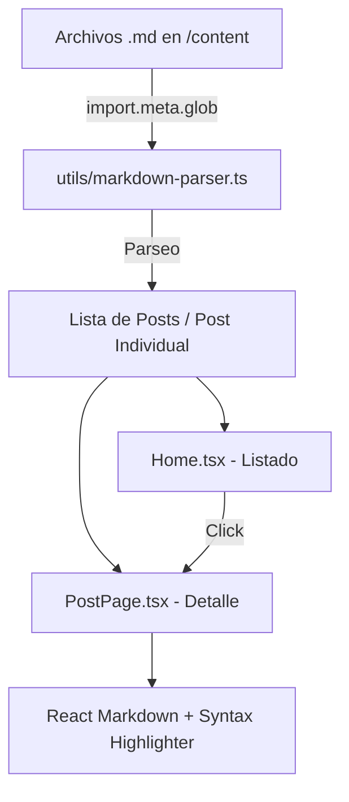

# Documentación Técnica - Bloggie

Bloggie es una plataforma de blog moderna, minimalista y de alto rendimiento construida con React 19 y Vite. El proyecto utiliza un enfoque de "Markdown-first", donde el contenido se gestiona a través de archivos locales, permitiendo una experiencia de desarrollo fluida y despliegues rápidos.

## 🚀 Arquitectura Tecnológica

La aplicación utiliza las siguientes tecnologías de vanguardia:

- **Framework**: [React 19](https://react.dev/)
- **Build Tool**: [Vite 8](https://vitejs.dev/)
- **Lenguaje**: [TypeScript](https://www.typescriptlang.org/)
- **Estilos**: [Tailwind CSS v4](https://tailwindcss.com/) (con el plugin de tipografía)
- **Enrutamiento**: [React Router 7](https://reactrouter.com/)
- **Contenido**: Markdown con frontmatter (YAML).
- **Renderizado de Markdown**: `react-markdown` para el cuerpo del post y `react-syntax-highlighter` para bloques de código.

---

## 📂 Estructura del Proyecto

```text
blogGerencia/
├── content/              # Archivos Markdown (.md) para los posts
├── public/               # Activos estáticos (imágenes, favicons)
├── src/
│   ├── assets/           # Estilos globales e imágenes locales
│   ├── components/       # Componentes de UI reutilizables (Navbar, Footer, PostCard)
│   ├── data/             # Configuración y datos estáticos (social links)
│   ├── pages/            # Vistas principales (Home, About, PostPage)
│   ├── types/            # Definiciones de interfaces TypeScript
│   ├── utils/            # Lógica de utilidad (parser de Markdown)
│   ├── App.tsx           # Configuración de rutas y layout global
│   └── main.tsx          # Punto de entrada de la aplicación
├── vercel.json           # Configuración para despliegue en Vercel
└── tailwind.config.ts    # Configuración de Tailwind CSS
```

---

## ⚙️ Flujo de Datos y Funcionamiento

El proyecto opera bajo un modelo de **Static Generation** simulado en el cliente:

1.  **Carga de Contenido**: Los archivos `.md` en `/content` son detectados por Vite usando `import.meta.glob`.
2.  **Procesamiento**: Un parser personalizado en `src/utils/markdown-parser.ts` extrae el **Frontmatter** (metadatos como título, fecha, autor) y el **Cuerpo** del post.
3.  **Enrutamiento Dinámico**: React Router utiliza el nombre del archivo (slug) para generar rutas dinámicas (`/post/:slug`).
4.  **Renderizado**: El componente `PostPage` recupera el contenido basado en el slug y lo renderiza usando componentes React para cada elemento de Markdown.

### Esquema de Flujo



---

## 🎨 Sistema de Diseño

El diseño se centra en la legibilidad y la estética "Premium Dark":

- **Tipografía**:
  - `Bricolage Grotesque`: Utilizada para encabezados y elementos de marca.
  - `Inter`: Utilizada para el cuerpo de texto y UI general.
- **Paleta de Colores**: Basada en tonos oscuros profundos con acentos vibrantes configurados en Tailwind v4.
- **Componentes**:
  - `Navbar`: Navegación fluida con efectos de desenfoque (glassmorphism).
  - `PostCard`: Tarjetas interactivas con efectos de hover.
  - `Layout`: Estructura consistente que envuelve todas las páginas.

---

## 🛠️ Configuración y Despliegue

### Requisitos
- Node.js 18+
- npm / pnpm / yarn

### Desarrollo Local
```bash
# Instalar dependencias
pnpm install

# Iniciar servidor de desarrollo
pnpm run dev
```

### Despliegue (Vercel)
El proyecto incluye un archivo `vercel.json` que maneja las rutas de Single Page Application (SPA) para evitar errores 404 al recargar páginas internas:

```json
{
  "rewrites": [{ "source": "/(.*)", "destination": "/index.html" }]
}
```

---

## 📝 Guía para Creadores de Contenido

Para añadir un nuevo post, crea un archivo `.md` en `/content/` con el siguiente formato:

```markdown
---
title: "Mi Nuevo Post"
date: "2024-05-14"
excerpt: "Una breve descripción de lo que trata este artículo."
author: "Nombre del Autor"
authorImage: "/authors/perfil.jpg"
imageUrl: "/posts/cover.jpg"
category: "Tecnología"
---

Contenido del post en **Markdown** aquí...
```
